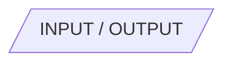
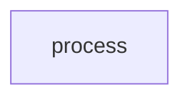
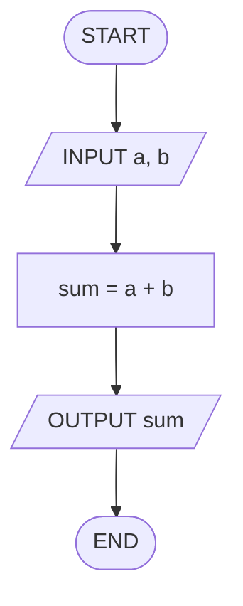

## Séance 1

Algorithmes et traitement séquentiel

[→ Quiz](quiz_seance_01.html)
[→ Exercices](exercices_seance_01.html)

---

## Qu'est-ce qu'un algorithme (*algorithm*) ?

Une **suite finie d'étapes** précises pour résoudre un problème.

- Indépendant d'un langage
- Exécutable « à la main », sur papier
- Produit un résultat clair

Exemples : recette de cuisine, itinéraire GPS, mode d'emploi.

---

## Algorithme, programme, langage de programmation

| Terme | Sens |
| --- | --- |
| Algorithme (*algorithm*) | Méthode / démarche (idées, étapes) |
| Programme (*program*) | Algorithme **écrit** dans un langage, exécutable par une machine |
| Langage de programmation (*programming language*) | Langage formel pour écrire des programmes (Python, C++…) |

L'algorithme **précède** le programme. Ce cours s'arrête à l'**algorithme** : on n'écrit pas encore un programme dans un langage.

---

## Entrée → traitement → sortie

Tout traitement suit la même démarche :

1. Entrée (*input*) — données d'entrée (saisie, valeurs connues)
2. Traitement (*process*) — calculs, transformations, enchaînement d'étapes
3. Sortie (*output*) — résultat affiché ou produit

Avant de concevoir l'algorithme : qu'est-ce qui entre ? que fait-on ? que sort-on ?

---

## Exemple : moyenne de deux notes

| Étape | Contenu |
| --- | --- |
| Entrée (*input*) | deux notes |
| Traitement (*process*) | les additionner, diviser par 2 |
| Sortie (*output*) | la moyenne |

Même idée pour un prix TTC, une conversion, une somme…

---

## Qu'est-ce qu'un *flowchart* ?

Un *flowchart* (organigramme) est un **dessin** de l'algorithme : des **boîtes** reliées par des **flèches**, lues dans l'ordre.

Chaque forme a un rôle fixe :

<div class="symbol-row">

**Ovale** : début / fin


</div>

<div class="symbol-row">

**Parallélogramme** : entrée / sortie



</div>

<div class="symbol-row">

**Rectangle** : traitement (*process*)



</div>

---

## Premier *flowchart*

Lire deux nombres, calculer leur somme, afficher le résultat.



---

## Lire un *flowchart*

De haut en bas, dans l'ordre :

1. Où commence-t-on ? (`START`)
2. Quelles **entrées** ? (`INPUT`)
3. Quels **traitements** ? (rectangles)
4. Quelle **sortie** ? (`OUTPUT`)
5. Où s'arrête-t-on ? (`END`)

Un *flowchart* séquentiel = **un seul chemin**, sans branche.

---

## Variables

Une **variable** est une case nommée qui contient une valeur.

- On lui donne un **nom** (identifiant)
- On lui associe un **type** (nature de la valeur)
- On peut **changer** sa valeur par affectation

En *flowchart* / *pseudocode* : noms en anglais simples (`sum`, `price`, `mark`).

---

## Types de base

| Type | Contenu | Exemples |
| --- | --- | --- |
| `INTEGER` | entier | `3`, `-1`, `42` |
| `REAL` | réel (virgule) | `3.14`, `-0.5` |
| `BOOLEAN` | vrai / faux | `TRUE`, `FALSE` |
| `STRING` | texte | `"hello"`, `"ISIB"` |

Le type fixe **ce qu'on peut faire** avec la valeur (calcul, comparaison, affichage…).

---

## Affectation

Symbole d'affectation : **`=`**

```text
total = a + b
```

**Attention :** ce n'est **pas** l'égalité mathématique.

- À **gauche** : la variable qui **reçoit**
- À **droite** : l'expression **calculée**
- On calcule la droite, puis on **range** le résultat à gauche

Donc `x = x + 1` a du sens ici (on remplace `x` par `x + 1`).

---

## Opérateurs arithmétiques

| Opérateur | Sens |
| --- | --- |
| `+` `-` `*` `/` | addition, soustraction, multiplication, division |
| `DIV` | quotient entier |
| `MOD` | reste de la division entière |

Exemples (`INTEGER`) :

- `17 DIV 5` → `3`
- `17 MOD 5` → `2`

Utile pour : heures/minutes, parité, découpage en paquets…

---

## Exemple : types + opérateurs

```text
a = 17          // INTEGER
b = 5           // INTEGER
q = a DIV b     // 3
r = a MOD b     // 2
avg = (a + b) / 2   // REAL si division réelle
```

Choisir le type selon le besoin : une moyenne est souvent un `REAL`.

---

## Table de trace (*trace table*) = exécution à la main (*dry run*)

Une *trace table* simule l'exécution **ligne par ligne**.

- Une colonne par variable (+ OUTPUT si besoin)
- Une ligne par étape
- On met à jour **seulement** ce qui change

Compétence d'examen : vérifier un algorithme **sans machine**.

---

## Exemple : *trace table* — somme

```text
INPUT a, b
sum = a + b
OUTPUT sum
```

Pour `a = 3`, `b = 5` :

| step | a | b | sum | OUTPUT |
| --- | --- | --- | --- | --- |
| `INPUT a, b` | 3 | 5 | | |
| `sum = a + b` | 3 | 5 | 8 | |
| `OUTPUT sum` | 3 | 5 | 8 | 8 |

On ne réécrit une case que quand la variable **change**.

---

## Exemple : *trace table* — `DIV` et `MOD`

<div class="two-cols">

<div>

```text
a = 17
b = 5
q = a DIV b
r = a MOD b
OUTPUT q, r
```

</div>

<div>

| step | a | b | q | r | OUTPUT |
| --- | --- | --- | --- | --- | --- |
| `a = 17` | 17 | | | | |
| `b = 5` | 17 | 5 | | | |
| `q = a DIV b` | 17 | 5 | 3 | | |
| `r = a MOD b` | 17 | 5 | 3 | 2 | |
| `OUTPUT q, r` | 17 | 5 | 3 | 2 | 3, 2 |

</div>

</div>

---

## Quiz

10 questions pour tester sa compréhension du contenu de la séance.

[→ Quiz](quiz_seance_01.html)

---

## Exercice 1.A — Trace table (`DIV` et `MOD`)

```text
a = 10
b = 4
result = (a DIV b) + (a MOD b)
OUTPUT result
```

Compléter la *trace table* (colonnes : step, `a`, `b`, `result`, OUTPUT).

→ [Exercices](exercices_seance_01.html) § 1.A

---

## Exercice 1.B — Dessiner un *flowchart* (TTC)

> Lire un prix HT (`priceHT`) et un taux (`rate`)  
> Calculer le prix TTC  
> Afficher le TTC

Formule : `priceTTC = priceHT * (1 + rate)`  
(ex. `rate = 0.21` pour 21 %)

→ [Exercices](exercices_seance_01.html) § 1.B

---

## Exercice 1.C — Trace table (heures et minutes)

```text
totalMinutes = 135
hours = totalMinutes DIV 60
minutes = totalMinutes MOD 60
OUTPUT hours, minutes
```

Compléter la *trace table* (colonnes : step, `totalMinutes`, `hours`, `minutes`, OUTPUT).

→ [Exercices](exercices_seance_01.html) § 1.C

---

## Exercice 1.D — Dessiner un *flowchart* (moyenne)

> Lire deux notes (`a`, `b`)  
> Calculer la moyenne  
> Afficher la moyenne

Formule : `avg = (a + b) / 2`

→ [Exercices](exercices_seance_01.html) § 1.D
