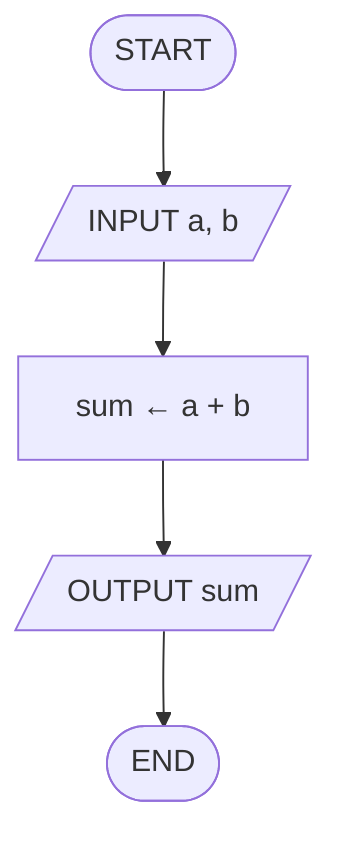

# Séance 1 — Exercices

**Thème :** Algorithmes et traitement séquentiel  
**Support :** *flowcharts* + *trace table* (texte FR — flowcharts + *pseudocode* EN)

<nav class="page-nav">
  <a href="cours_seance_01.html">← Cours</a>
  <a href="quiz_seance_01.html">Quiz →</a>
  <a href="../../index.html">Accueil</a>
</nav>

## 1.A — Classer (algorithme / programme / ni l'un ni l'autre)

Pour chaque item, indiquer *algorithm*, *program* ou *neither*, et justifier en une phrase.

1. Une recette de cuisine détaillée
2. Une application mobile déjà installée sur le téléphone
3. L'itinéraire affiché par un GPS
4. Le langage Python lui-même

---

## 1.B — Lire un *flowchart* + tracer

Soit le *flowchart* séquentiel suivant (somme de deux nombres) :



1. Quelles sont les **entrées** ? la **sortie** ? l'**ordre** des étapes ?
2. Pour `a = 3` et `b = 5`, que produit l'algorithme ?
3. Compléter la *trace table* :

| step | a | b | sum | OUTPUT |
| --- | --- | --- | --- | --- |
| INPUT | | | | |
| process | | | | |
| OUTPUT | | | | |

---

## 1.C — Compléter une *trace table*

Exécuter « à la main » l'algorithme suivant :

```text
a ← 10
b ← 4
result ← (a DIV b) + (a MOD b)
OUTPUT result
```

Compléter :

| step | a | b | result | OUTPUT |
| --- | --- | --- | --- | --- |
| `a ← 10` | | | | |
| `b ← 4` | | | | |
| `result ← …` | | | | |
| `OUTPUT result` | | | | |

Rappel : `DIV` = quotient entier ; `MOD` = reste.

---

## 1.D — Produire un *flowchart*

Dessiner un *flowchart* (symboles `START` / `END`, `INPUT` / `OUTPUT`, process) pour :

> Lire un prix hors taxes (`priceHT`) et un taux (`rate`).  
> Calculer le prix TTC : `priceTTC ← priceHT * (1 + rate)`.  
> Afficher `priceTTC`.

**Variante :** *flowchart* de la moyenne de deux nombres (`avg ← (a + b) / 2`).

---

## Corrigé (enseignant)

### 1.A

| Item | Classe |
| --- | --- |
| Recette | *algorithm* |
| App installée | *program* |
| Itinéraire GPS | *algorithm* (ou résultat d'un *algorithm*) |
| Python | *neither* (*programming language*) |

### 1.B

Entrées `a`, `b` ; sortie `sum` ; pour `3` et `5` → **OUTPUT 8**.

### 1.C

`10 DIV 4 = 2`, `10 MOD 4 = 2` → `result = 4` → **OUTPUT 4**.

### 1.D

`START` → `INPUT priceHT, rate` → `priceTTC ← priceHT * (1 + rate)` → `OUTPUT priceTTC` → `END`.

<footer class="site-footer"><a href="mailto:shuraux@he2b.be">Sylvain Huraux - HE2B - ISIB</a></footer>
