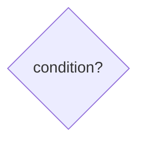
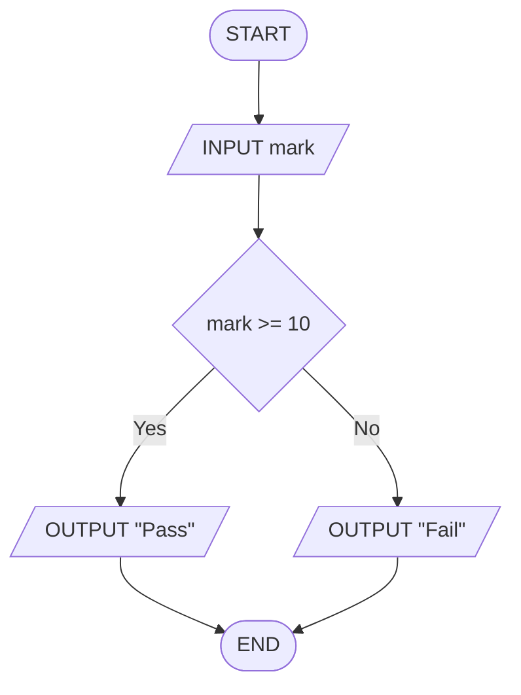
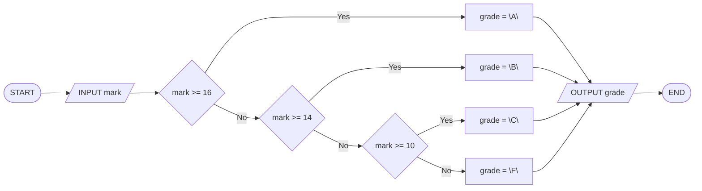
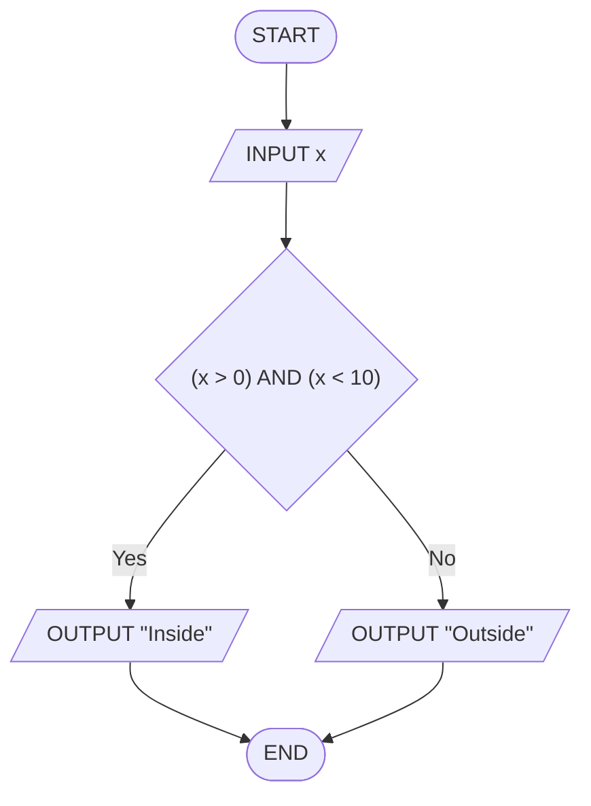

## Séance 2

Instructions conditionnelles

[→ Quiz](quiz_seance_02.html)
[→ Exercices](exercices_seance_02.html)

---

## Pourquoi des décisions ?

En séance 1 : **un seul chemin**, de haut en bas.

Souvent, le traitement **change** selon une situation :

- note suffisante ou non ?
- âge donnant droit à une réduction ?
- température trop haute, trop basse, ou acceptable ?

Il faut une **décision** (*decision*) : une question **oui / non**, puis **deux chemins** possibles.

---

## Le losange (*decision*)

Nouveau symbole : le **losange**.



- À l'intérieur : une **condition** (vrai ou faux)
- Deux sorties : **Yes** et **No**
- Une seule sortie est suivie à chaque exécution

Le reste des symboles ne change pas : ovale, parallélogramme, rectangle.

---

## Exemple : Pass / Fail

<div class="two-cols">

<div>

Lire `mark`.  
`mark >= 10` → `"Pass"`, sinon `"Fail"`.

Deux chemins, **un seul** suivi.

</div>

<div class="max-mermaid-lg">



</div>

</div>

---

## `IF … THEN … ELSE … END IF`

Même idée en *pseudocode* :

<div class="two-cols">

<div>

```text
INPUT mark
IF mark >= 10 THEN
  OUTPUT "Pass"
ELSE
  OUTPUT "Fail"
END IF
```

</div>

<div>

| Mot-clé | Rôle |
| --- | --- |
| `IF` | condition |
| `THEN` | branche **Yes** |
| `ELSE` | branche **No** |
| `END IF` | fin |

*Flowchart* et *pseudocode* = **même** algo.

</div>

</div>

---

## Opérateurs de comparaison

Condition → `TRUE` / `FALSE` (`BOOLEAN`).

<div class="two-cols">

<div>

| Op. | Sens |
| --- | --- |
| `=` | égal *(≠ affectation)* |
| `<>` | différent |
| `<` / `<=` | inférieur / ≤ |
| `>` / `>=` | supérieur / ≥ |

</div>

<div>

Ex. : `mark >= 10`, `age < 12`, `x = 0`.

**Attention :** `=` range (affectation) **ou** compare (condition).

</div>

</div>

---

## `IF` sans `ELSE`

Parfois on ne fait quelque chose **que** si la condition est vraie.

```text
INPUT temperature
IF temperature > 30 THEN
  OUTPUT "Hot"
END IF
OUTPUT "Done"
```

- Branche **Yes** : affiche `"Hot"`, puis continue
- Branche **No** : saute le bloc, continue vers `"Done"`

En *flowchart* : la flèche **No** contourne le traitement et rejoint la suite.

---

## Plusieurs cas : `ELSE IF`

Quand il y a **plus de deux** possibilités, on enchaîne (*cascade*) :

```text
INPUT mark
IF mark >= 16 THEN
  grade = "A"
ELSE IF mark >= 14 THEN
  grade = "B"
ELSE IF mark >= 10 THEN
  grade = "C"
ELSE
  grade = "F"
END IF
OUTPUT grade
```

On teste **dans l'ordre** ; dès qu'une condition est vraie, on prend cette branche et on **ignore** le reste.

---

## Cascade en *flowchart*



Ordre des seuils : du plus exigeant au plus bas (sinon un cas « avale » les autres).

---

## Conditions composées : `AND` / `OR` / `NOT`

On combine des conditions avec des opérateurs logiques :

| Opérateur | Sens | Exemple |
| --- | --- | --- |
| `AND` | les **deux** sont vraies | `(x > 0) AND (x < 10)` |
| `OR` | **au moins une** est vraie | `(age < 12) OR (age >= 65)` |
| `NOT` | inverse vrai ↔ faux | `NOT (mark >= 10)` |

Résultat toujours `TRUE` ou `FALSE`.

---

## Tables de vérité (*truth tables*)

<div class="two-cols">

<div>

Pour `AND` :

| A | B | A AND B |
| --- | --- | --- |
| `FALSE` | `FALSE` | `FALSE` |
| `FALSE` | `TRUE` | `FALSE` |
| `TRUE` | `FALSE` | `FALSE` |
| `TRUE` | `TRUE` | `TRUE` |

</div>

<div>

Pour `OR` :

| A | B | A OR B |
| --- | --- | --- |
| `FALSE` | `FALSE` | `FALSE` |
| `FALSE` | `TRUE` | `TRUE` |
| `TRUE` | `FALSE` | `TRUE` |
| `TRUE` | `TRUE` | `TRUE` |

</div>

</div>

`NOT` : `NOT TRUE` → `FALSE` ; `NOT FALSE` → `TRUE`.

---

## Exemple : `AND` dans un `IF`

« Est-ce que `x` est strictement entre 0 et 10 ? »

<div class="two-cols">

<div>

```text
INPUT x
IF (x > 0) AND (x < 10) THEN
  OUTPUT "Inside"
ELSE
  OUTPUT "Outside"
END IF
```

</div>

<div class="max-mermaid">



</div>

</div>

---

## Conditions imbriquées (*nested*)

Un `IF` **à l'intérieur** d'un autre `IF` :

```text
INPUT age, hasTicket
IF hasTicket = TRUE THEN
  IF age >= 18 THEN
    OUTPUT "Adult entry"
  ELSE
    OUTPUT "Child entry"
  END IF
ELSE
  OUTPUT "No ticket"
END IF
```

Utile quand la **deuxième** question n'a de sens que si la première est vraie.

---

## Cascade vs imbrication

| Style | Idée |
| --- | --- |
| Cascade (`ELSE IF`) | plusieurs cas **mutuellement exclusifs** sur la même donnée (notes A/B/C/F) |
| Imbrication (*nested*) | une décision **dépend** d'une autre (billet, puis âge) |

Les deux sont corrects ; on choisit selon la structure du problème.

Piège fréquent : une branche **inaccessible** (condition déjà couverte plus haut, ou ordre des tests incorrect).

---

<!-- _class: compact -->

## *Test cases* et *edge cases*

Pour valider un algorithme à décisions :

- ***Test case*** : un jeu de données d'entrée + le résultat **attendu**
- ***Edge case*** (*cas limite*) : valeur juste au seuil, vide, extrême…

Exemple pour `mark >= 10` → Pass / Fail :

| *Test case* | Entrée | Attendu |
| --- | --- | --- |
| typique Yes | `mark = 14` | `"Pass"` |
| typique No | `mark = 7` | `"Fail"` |
| *edge* | `mark = 10` | `"Pass"` (seuil inclus) |
| *edge* | `mark = 9` | `"Fail"` (juste en dessous) |

Sans *edge cases*, on rate souvent une erreur de `<` vs `<=`.

---

## Exemple : réduction d'âge

Réduction si `age < 12` **ou** `age >= 65`.

```text
INPUT age
IF (age < 12) OR (age >= 65) THEN
  OUTPUT "Discount"
ELSE
  OUTPUT "Full price"
END IF
```

*Edge cases* utiles : `age = 12`, `age = 65`, `age = 11`, `age = 64`.

---

## Quiz

10 questions pour tester sa compréhension du contenu de la séance.

[→ Quiz](quiz_seance_02.html)

---

## Exercice 2.A — Alerte chaleur (`IF` sans `ELSE`)

```text
INPUT temperature
IF temperature > hotLimit THEN
  OUTPUT "Hot"
END IF
OUTPUT "Done"
```

1. *Trace table* : `temperature = 32`, `hotLimit = 30`.
2. Dessiner le *flowchart* (branche **No** contourne `"Hot"`).

→ [Exercices](exercices_seance_02.html) § 2.A

---

## Exercice 2.B — Valeur absolue (`IF` / `ELSE`)

```text
INPUT x
IF x < 0 THEN
  absValue = zero - x
ELSE
  absValue = x
END IF
OUTPUT absValue
```

1. *Trace table* : `x = -5`, `zero = 0`.
2. Dessiner le *flowchart* (calcul dans les processus).

→ [Exercices](exercices_seance_02.html) § 2.B

---

## Exercice 2.C — Entrée billetterie (`IF` imbriqué)

```text
INPUT hasTicket, age
IF hasTicket = TRUE THEN
  IF age >= adultAge THEN
    entry = "Adult"
  ELSE
    entry = "Child"
  END IF
ELSE
  entry = "Denied"
END IF
OUTPUT entry
```

1. *Trace table* : `hasTicket = TRUE`, `age = 16`, `adultAge = 18`.
2. Dessiner le *flowchart* (deux losanges imbriqués).

→ [Exercices](exercices_seance_02.html) § 2.C

---

## Exercice 2.D — Réussite avec présence (`AND` / `NOT`)

```text
INPUT mark, isAbsent
IF (NOT isAbsent) AND (mark >= passMark) THEN
  status = "Pass"
ELSE
  status = "Fail"
END IF
OUTPUT status
```

1. *Trace table* : `mark = 12`, `isAbsent = FALSE`, `passMark = 10`.
2. Dessiner le *flowchart* (condition composée dans un losange).

→ [Exercices](exercices_seance_02.html) § 2.D
---

## Exercice 2.E — Mentions (cascade)

```text
INPUT mark
IF mark >= gradeA THEN
  grade = "A"
ELSE IF mark >= gradeB THEN
  grade = "B"
ELSE IF mark >= gradeC THEN
  grade = "C"
ELSE
  grade = "F"
END IF
OUTPUT grade
```

1. *Trace table* : `mark = 14`, `gradeA = 16`, `gradeB = 14`, `gradeC = 10`.
2. Dessiner le *flowchart* (cascade ; bornes nommées).

→ [Exercices](exercices_seance_02.html) § 2.E
