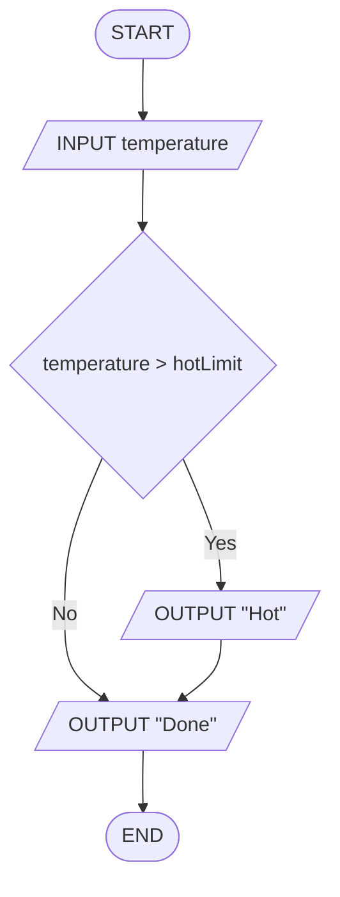
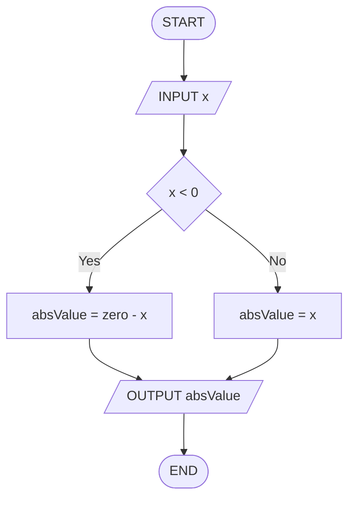
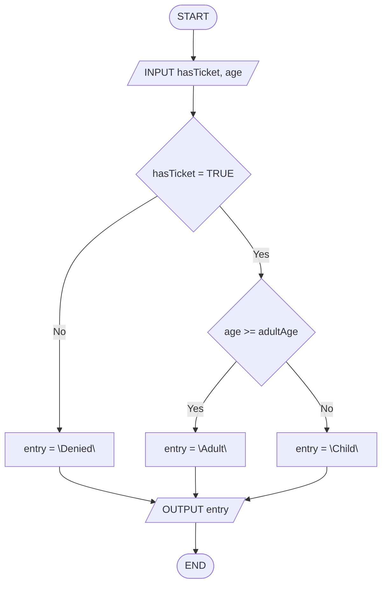
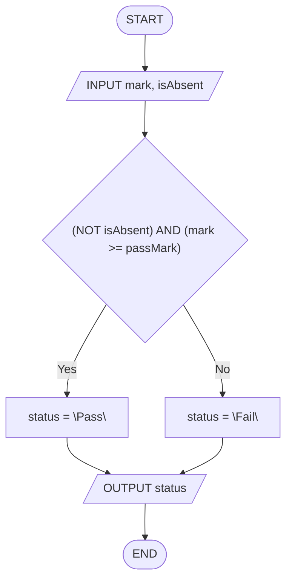

# Séance 2 — Exercices

**Thème :** Instructions conditionnelles  
**Support :** *flowcharts* (losange Yes/No) + *trace table* (texte FR — flowcharts + *pseudocode* EN)

Pour **chaque** exercice : produire une *trace table* **et** un *flowchart*.  
Dans les *flowcharts* : pas de littéraux numériques (les valeurs concrètes apparaissent **uniquement** dans la *trace table*).

<nav class="page-nav">
  <a href="cours_seance_02.html">← Cours</a>
  <a href="quiz_seance_02.html">Quiz →</a>
  <a href="../../index.html">Accueil</a>
</nav>

## 2.A — Alerte chaleur (`IF` sans `ELSE`)

Algorithme :

```text
INPUT temperature
IF temperature > hotLimit THEN
  OUTPUT "Hot"
END IF
OUTPUT "Done"
```

Données de la *trace* : `temperature = 32`, `hotLimit = 30`.

1. Compléter la *trace table* :

| step | temperature | hotLimit | OUTPUT |
| --- | --- | --- | --- |
| `INPUT temperature` | | | |
| `IF temperature > hotLimit` | | | |
| … | | | |
| `OUTPUT "Done"` | | | |

2. Dessiner le *flowchart* (la branche **No** contourne `"Hot"` et rejoint `"Done"`).

<details class="corrige">
<summary>Corrigé</summary>

`32 > 30` → Yes → **OUTPUT Hot**, puis **OUTPUT Done**.  
*Edge* utile : `temperature = hotLimit` → pas de `"Hot"`, seulement `"Done"`.

| step | temperature | hotLimit | OUTPUT |
| --- | --- | --- | --- |
| `INPUT temperature` | 32 | 30 | |
| `IF temperature > hotLimit` | 32 | 30 | |
| `OUTPUT "Hot"` | 32 | 30 | Hot |
| `OUTPUT "Done"` | 32 | 30 | Done |



</details>

---

## 2.B — Valeur absolue (`IF` / `ELSE`)

Algorithme :

```text
INPUT x
IF x < 0 THEN
  absValue = zero - x
ELSE
  absValue = x
END IF
OUTPUT absValue
```

Données de la *trace* : `x = -5`, `zero = 0`.

1. Compléter la *trace table* :

| step | x | zero | absValue | OUTPUT |
| --- | --- | --- | --- | --- |
| `INPUT x` | | | | |
| `IF x < 0` | | | | |
| `absValue = …` | | | | |
| `OUTPUT absValue` | | | | |

2. Dessiner le *flowchart* (calcul dans les rectangles de processus).

<details class="corrige">
<summary>Corrigé</summary>

`-5 < 0` → Yes → `absValue = 0 - (-5) = 5` → **OUTPUT 5**.  
*Edge* : `x = 0` → branche No → `absValue = 0`.

| step | x | zero | absValue | OUTPUT |
| --- | --- | --- | --- | --- |
| `INPUT x` | -5 | 0 | | |
| `IF x < 0` | -5 | 0 | | |
| `absValue = zero - x` | -5 | 0 | 5 | |
| `OUTPUT absValue` | -5 | 0 | 5 | 5 |



</details>

---

## 2.C — Entrée billetterie (`IF` imbriqué)

Algorithme :

```text
INPUT hasTicket, age
IF hasTicket = TRUE THEN
  IF age >= adultAge THEN
    entry = "Adult"
  ELSE
    entry = "Child"
  END IF
ELSE
  entry = "Denied"
END IF
OUTPUT entry
```

Données de la *trace* : `hasTicket = TRUE`, `age = 16`, `adultAge = 18`.

1. Compléter la *trace table* :

| step | hasTicket | age | adultAge | entry | OUTPUT |
| --- | --- | --- | --- | --- | --- |
| `INPUT hasTicket, age` | | | | | |
| `IF hasTicket = TRUE` | | | | | |
| `IF age >= adultAge` | | | | | |
| `entry = …` | | | | | |
| `OUTPUT entry` | | | | | |

2. Dessiner le *flowchart* (deux losanges imbriqués).

<details class="corrige">
<summary>Corrigé</summary>

`hasTicket = TRUE` → Yes ; `16 >= 18` → No → `entry = "Child"` → **OUTPUT Child**.  
Sans billet, le deuxième test n'a **pas** de sens (branche `"Denied"`).

| step | hasTicket | age | adultAge | entry | OUTPUT |
| --- | --- | --- | --- | --- | --- |
| `INPUT hasTicket, age` | TRUE | 16 | 18 | | |
| `IF hasTicket = TRUE` | TRUE | 16 | 18 | | |
| `IF age >= adultAge` | TRUE | 16 | 18 | | |
| `entry = "Child"` | TRUE | 16 | 18 | Child | |
| `OUTPUT entry` | TRUE | 16 | 18 | Child | Child |



</details>

---

## 2.D — Réussite avec présence (`AND` / `NOT`)

Algorithme :

```text
INPUT mark, isAbsent
IF (NOT isAbsent) AND (mark >= passMark) THEN
  status = "Pass"
ELSE
  status = "Fail"
END IF
OUTPUT status
```

Données de la *trace* : `mark = 12`, `isAbsent = FALSE`, `passMark = 10`.

1. Compléter la *trace table* :

| step | mark | isAbsent | passMark | status | OUTPUT |
| --- | --- | --- | --- | --- | --- |
| `INPUT mark, isAbsent` | | | | | |
| `IF (NOT isAbsent) AND (mark >= passMark)` | | | | | |
| `status = …` | | | | | |
| `OUTPUT status` | | | | | |

2. Dessiner le *flowchart* (condition composée dans **un** losange).

<details class="corrige">
<summary>Corrigé</summary>

`(NOT FALSE) AND (12 >= 10)` → `TRUE AND TRUE` → Yes → **OUTPUT Pass**.  
*Edge* : `isAbsent = TRUE` même avec `mark` haute → Fail (`NOT TRUE` → `FALSE`).

| step | mark | isAbsent | passMark | status | OUTPUT |
| --- | --- | --- | --- | --- | --- |
| `INPUT mark, isAbsent` | 12 | FALSE | 10 | | |
| `IF (NOT isAbsent) AND (mark >= passMark)` | 12 | FALSE | 10 | | |
| `status = "Pass"` | 12 | FALSE | 10 | Pass | |
| `OUTPUT status` | 12 | FALSE | 10 | Pass | Pass |



</details>

---

## 2.E — Mentions (cascade)

Algorithme :

```text
INPUT mark
IF mark >= gradeA THEN
  grade = "A"
ELSE IF mark >= gradeB THEN
  grade = "B"
ELSE IF mark >= gradeC THEN
  grade = "C"
ELSE
  grade = "F"
END IF
OUTPUT grade
```

Données de la *trace* : `mark = 14`, `gradeA = 16`, `gradeB = 14`, `gradeC = 10`.

1. Compléter la *trace table* :

| step | mark | gradeA | gradeB | gradeC | grade | OUTPUT |
| --- | --- | --- | --- | --- | --- | --- |
| `INPUT mark` | | | | | | |
| `IF mark >= gradeA` | | | | | | |
| `ELSE IF mark >= gradeB` | | | | | | |
| `grade = …` | | | | | | |
| `OUTPUT grade` | | | | | | |

2. Dessiner le *flowchart* (cascade de losanges ; bornes nommées).

<details class="corrige">
<summary>Corrigé</summary>

`14 >= 16` → No ; `14 >= 14` → Yes → `grade = "B"` → **OUTPUT B** (on **ignore** le test `gradeC`).

| step | mark | gradeA | gradeB | gradeC | grade | OUTPUT |
| --- | --- | --- | --- | --- | --- | --- |
| `INPUT mark` | 14 | 16 | 14 | 10 | | |
| `IF mark >= gradeA` | 14 | 16 | 14 | 10 | | |
| `ELSE IF mark >= gradeB` | 14 | 16 | 14 | 10 | | |
| `grade = "B"` | 14 | 16 | 14 | 10 | B | |
| `OUTPUT grade` | 14 | 16 | 14 | 10 | B | B |


</details>

<footer class="site-footer"><a href="mailto:shuraux@he2b.be">Sylvain Huraux - HE2B - ISIB</a></footer>
