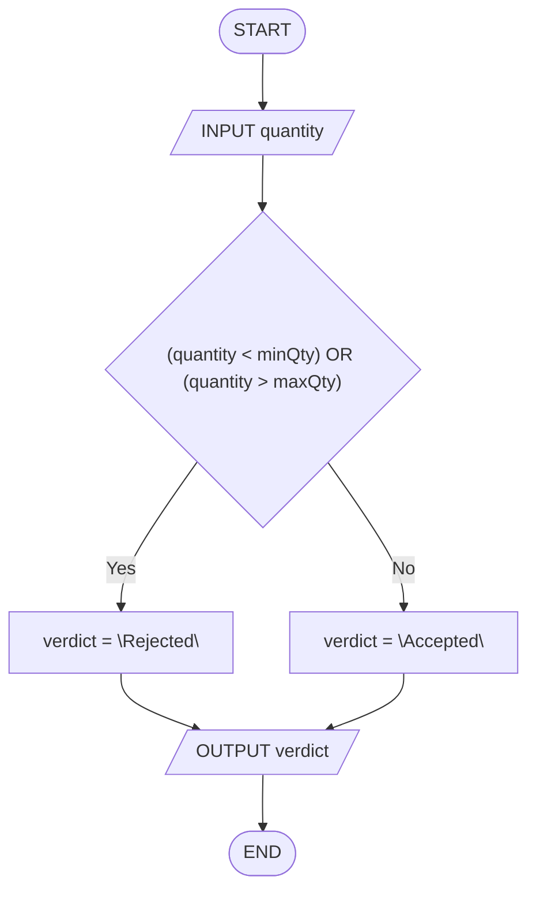
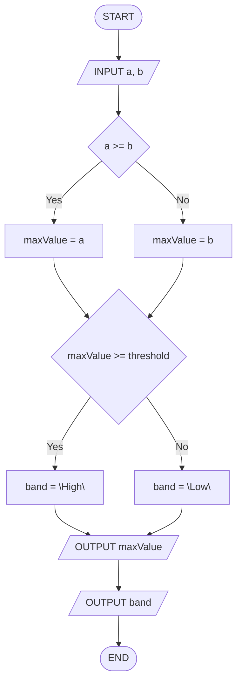
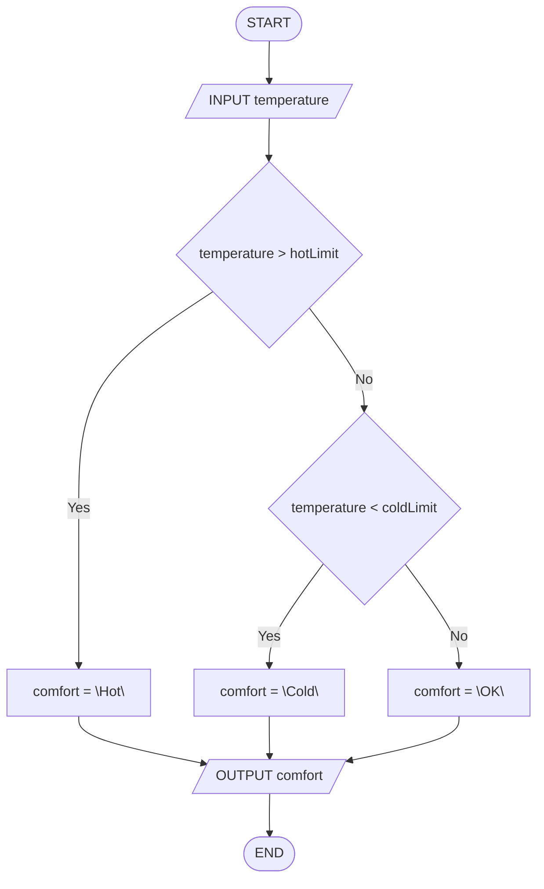
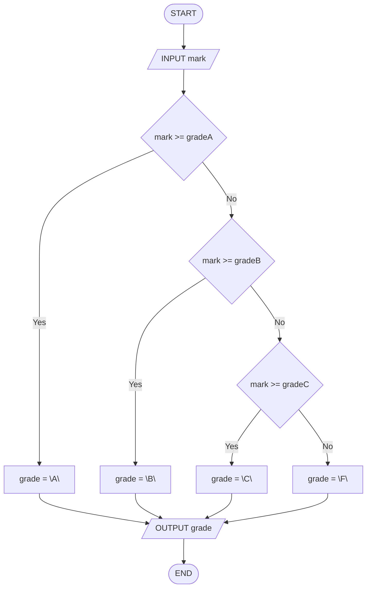

# Séance 2 — Exercices

**Thème :** Instructions conditionnelles  
**Support :** *flowcharts* (losange Yes/No) + *trace table* (texte FR — flowcharts + *pseudocode* EN)

Pour **chaque** exercice : produire une *trace table* **et** un *flowchart*.  
Dans les *flowcharts* : pas de littéraux numériques (les valeurs concrètes apparaissent **uniquement** dans la *trace table*).

<nav class="page-nav">
  <a href="cours_seance_02.html">← Cours</a>
  <a href="quiz_seance_02.html">Quiz →</a>
  <a href="../../index.html">Accueil</a>
</nav>

## 2.A — Quantité hors bornes (`OR` + validation)

Algorithme :

```text
INPUT quantity
IF (quantity < minQty) OR (quantity > maxQty) THEN
  verdict = "Rejected"
ELSE
  verdict = "Accepted"
END IF
OUTPUT verdict
```

Données de la *trace* : `quantity = 150`, `minQty = 1`, `maxQty = 100`.

1. Compléter la *trace table* :

| step | quantity | minQty | maxQty | verdict | OUTPUT |
| --- | --- | --- | --- | --- | --- |
| `INPUT quantity` | | | | | |
| `IF (quantity < minQty) OR (quantity > maxQty)` | | | | | |
| `verdict = …` | | | | | |
| `OUTPUT verdict` | | | | | |

2. Dessiner le *flowchart* (condition `OR` dans **un** losange ; bornes nommées).

<details class="corrige">
<summary>Corrigé</summary>

`(150 < 1) OR (150 > 100)` → `FALSE OR TRUE` → Yes → `verdict = "Rejected"` → **OUTPUT Rejected**.  
*Edge* : `quantity = minQty` ou `quantity = maxQty` → Accepted (seuils inclus côté `ELSE`).

| step | quantity | minQty | maxQty | verdict | OUTPUT |
| --- | --- | --- | --- | --- | --- |
| `INPUT quantity` | 150 | 1 | 100 | | |
| `IF (quantity < minQty) OR (quantity > maxQty)` | 150 | 1 | 100 | | |
| `verdict = "Rejected"` | 150 | 1 | 100 | Rejected | |
| `OUTPUT verdict` | 150 | 1 | 100 | Rejected | Rejected |



</details>

---

## 2.B — Maximum puis niveau (deux décisions en séquence)

Algorithme :

```text
INPUT a, b
IF a >= b THEN
  maxValue = a
ELSE
  maxValue = b
END IF
IF maxValue >= threshold THEN
  band = "High"
ELSE
  band = "Low"
END IF
OUTPUT maxValue
OUTPUT band
```

Données de la *trace* : `a = 3`, `b = 8`, `threshold = 5`.

1. Compléter la *trace table* :

| step | a | b | threshold | maxValue | band | OUTPUT |
| --- | --- | --- | --- | --- | --- | --- |
| `INPUT a, b` | | | | | | |
| `IF a >= b` | | | | | | |
| `maxValue = …` | | | | | | |
| `IF maxValue >= threshold` | | | | | | |
| `band = …` | | | | | | |
| `OUTPUT maxValue` | | | | | | |
| `OUTPUT band` | | | | | | |

2. Dessiner le *flowchart* (**deux** losanges **l'un après l'autre**, pas imbriqués).

<details class="corrige">
<summary>Corrigé</summary>

`3 >= 8` → No → `maxValue = 8` ; puis `8 >= 5` → Yes → `band = "High"` → **OUTPUT 8**, puis **OUTPUT High**.  
Les deux tests s'exécutent **toujours** (contrairement à l'imbrication de 2.C).

| step | a | b | threshold | maxValue | band | OUTPUT |
| --- | --- | --- | --- | --- | --- | --- |
| `INPUT a, b` | 3 | 8 | 5 | | | |
| `IF a >= b` | 3 | 8 | 5 | | | |
| `maxValue = b` | 3 | 8 | 5 | 8 | | |
| `IF maxValue >= threshold` | 3 | 8 | 5 | 8 | | |
| `band = "High"` | 3 | 8 | 5 | 8 | High | |
| `OUTPUT maxValue` | 3 | 8 | 5 | 8 | High | 8 |
| `OUTPUT band` | 3 | 8 | 5 | 8 | High | High |



</details>

---

## 2.C — Entrée billetterie (`IF` imbriqué)

Algorithme :

```text
INPUT hasTicket, age
IF hasTicket = TRUE THEN
  IF age >= adultAge THEN
    entry = "Adult"
  ELSE
    entry = "Child"
  END IF
ELSE
  entry = "Denied"
END IF
OUTPUT entry
```

Données de la *trace* : `hasTicket = TRUE`, `age = 16`, `adultAge = 18`.

1. Compléter la *trace table* :

| step | hasTicket | age | adultAge | entry | OUTPUT |
| --- | --- | --- | --- | --- | --- |
| `INPUT hasTicket, age` | | | | | |
| `IF hasTicket = TRUE` | | | | | |
| `IF age >= adultAge` | | | | | |
| `entry = …` | | | | | |
| `OUTPUT entry` | | | | | |

2. Dessiner le *flowchart* (deux losanges imbriqués).

<details class="corrige">
<summary>Corrigé</summary>

`hasTicket = TRUE` → Yes ; `16 >= 18` → No → `entry = "Child"` → **OUTPUT Child**.  
Sans billet, le deuxième test n'a **pas** de sens (branche `"Denied"`).

| step | hasTicket | age | adultAge | entry | OUTPUT |
| --- | --- | --- | --- | --- | --- |
| `INPUT hasTicket, age` | TRUE | 16 | 18 | | |
| `IF hasTicket = TRUE` | TRUE | 16 | 18 | | |
| `IF age >= adultAge` | TRUE | 16 | 18 | | |
| `entry = "Child"` | TRUE | 16 | 18 | Child | |
| `OUTPUT entry` | TRUE | 16 | 18 | Child | Child |


</details>

---

## 2.D — Confort thermique (`ELSE IF` court)

Algorithme :

```text
INPUT temperature
IF temperature > hotLimit THEN
  comfort = "Hot"
ELSE IF temperature < coldLimit THEN
  comfort = "Cold"
ELSE
  comfort = "OK"
END IF
OUTPUT comfort
```

Données de la *trace* : `temperature = 5`, `hotLimit = 28`, `coldLimit = 16`.

1. Compléter la *trace table* :

| step | temperature | hotLimit | coldLimit | comfort | OUTPUT |
| --- | --- | --- | --- | --- | --- |
| `INPUT temperature` | | | | | |
| `IF temperature > hotLimit` | | | | | |
| `ELSE IF temperature < coldLimit` | | | | | |
| `comfort = …` | | | | | |
| `OUTPUT comfort` | | | | | |

2. Dessiner le *flowchart* (cascade **courte** : deux losanges + `ELSE` final ; bornes nommées).

<details class="corrige">
<summary>Corrigé</summary>

`5 > 28` → No ; `5 < 16` → Yes → `comfort = "Cold"` → **OUTPUT Cold**.  
*Edge* : entre les deux bornes (ex. `temperature = 20`) → branche `ELSE` → `"OK"`.  
Diffère de 2.E : ici **trois** issues seulement, pas toute la cascade des mentions.

| step | temperature | hotLimit | coldLimit | comfort | OUTPUT |
| --- | --- | --- | --- | --- | --- |
| `INPUT temperature` | 5 | 28 | 16 | | |
| `IF temperature > hotLimit` | 5 | 28 | 16 | | |
| `ELSE IF temperature < coldLimit` | 5 | 28 | 16 | | |
| `comfort = "Cold"` | 5 | 28 | 16 | Cold | |
| `OUTPUT comfort` | 5 | 28 | 16 | Cold | Cold |



</details>

---

## 2.E — Mentions (cascade)

Algorithme :

```text
INPUT mark
IF mark >= gradeA THEN
  grade = "A"
ELSE IF mark >= gradeB THEN
  grade = "B"
ELSE IF mark >= gradeC THEN
  grade = "C"
ELSE
  grade = "F"
END IF
OUTPUT grade
```

Données de la *trace* : `mark = 14`, `gradeA = 16`, `gradeB = 14`, `gradeC = 10`.

1. Compléter la *trace table* :

| step | mark | gradeA | gradeB | gradeC | grade | OUTPUT |
| --- | --- | --- | --- | --- | --- | --- |
| `INPUT mark` | | | | | | |
| `IF mark >= gradeA` | | | | | | |
| `ELSE IF mark >= gradeB` | | | | | | |
| `grade = …` | | | | | | |
| `OUTPUT grade` | | | | | | |

2. Dessiner le *flowchart* (cascade de losanges ; bornes nommées).

<details class="corrige">
<summary>Corrigé</summary>

`14 >= 16` → No ; `14 >= 14` → Yes → `grade = "B"` → **OUTPUT B** (on **ignore** le test `gradeC`).

| step | mark | gradeA | gradeB | gradeC | grade | OUTPUT |
| --- | --- | --- | --- | --- | --- | --- |
| `INPUT mark` | 14 | 16 | 14 | 10 | | |
| `IF mark >= gradeA` | 14 | 16 | 14 | 10 | | |
| `ELSE IF mark >= gradeB` | 14 | 16 | 14 | 10 | | |
| `grade = "B"` | 14 | 16 | 14 | 10 | B | |
| `OUTPUT grade` | 14 | 16 | 14 | 10 | B | B |



</details>

<footer class="site-footer"><a href="mailto:shuraux@he2b.be">Sylvain Huraux - HE2B - ISIB</a></footer>
