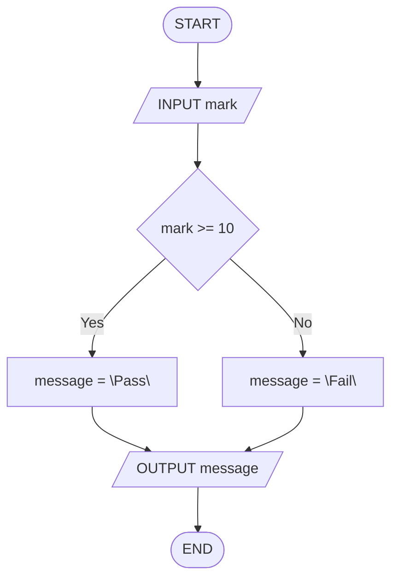
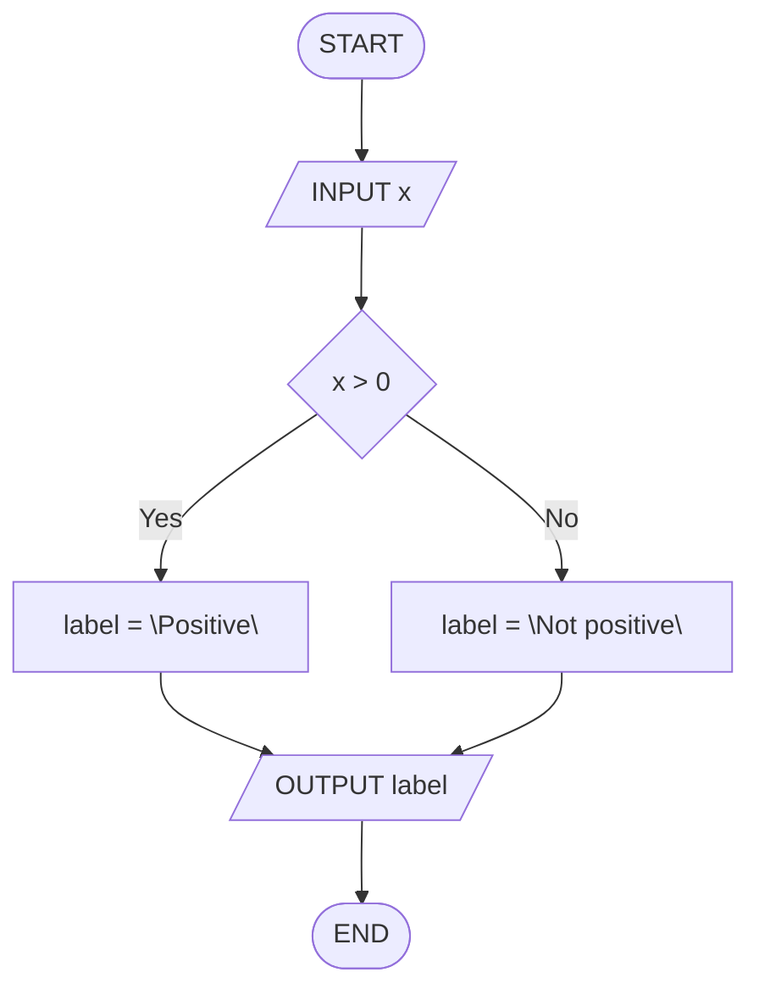
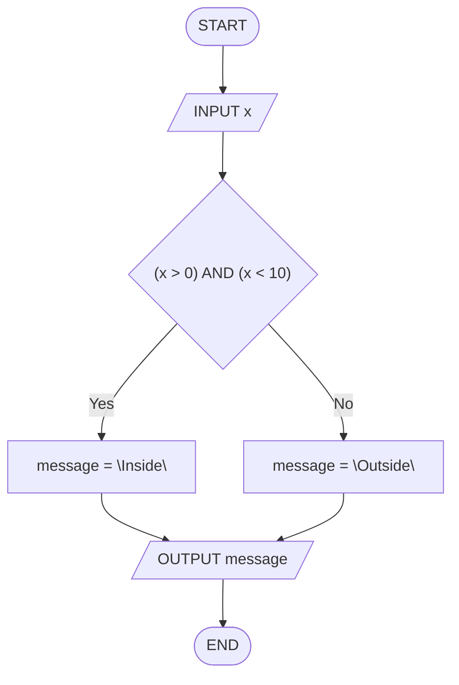
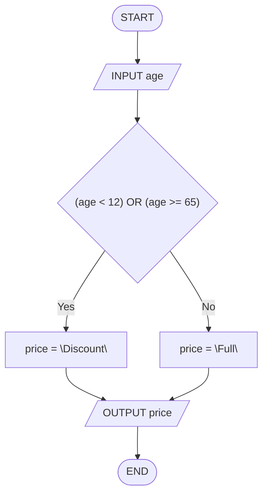
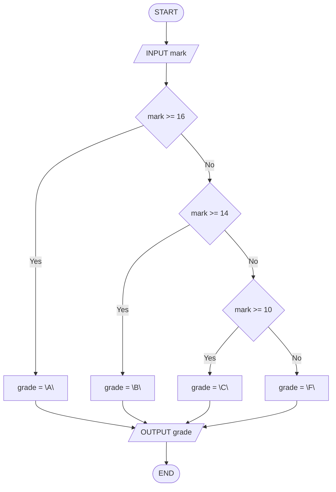

# Séance 2 — Exercices

**Thème :** Instructions conditionnelles  
**Support :** *flowcharts* (losange Yes/No) + *trace table* (texte FR — flowcharts + *pseudocode* EN)

Pour **chaque** exercice : produire une *trace table* **et** un *flowchart*.

<nav class="page-nav">
  <a href="cours_seance_02.html">← Cours</a>
  <a href="quiz_seance_02.html">Quiz →</a>
  <a href="../../index.html">Accueil</a>
</nav>

## 2.A — Pass / Fail

Algorithme :

```text
INPUT mark
IF mark >= 10 THEN
  message = "Pass"
ELSE
  message = "Fail"
END IF
OUTPUT message
```

1. Compléter la *trace table* pour `mark = 12` :

| step | mark | message | OUTPUT |
| --- | --- | --- | --- |
| `INPUT mark` | | | |
| `IF mark >= 10` | | | |
| `message = …` | | | |
| `OUTPUT message` | | | |

2. Dessiner le *flowchart* (`START` / `END`, `INPUT` / `OUTPUT`, losange Yes/No).

<details class="corrige">
<summary>Corrigé</summary>

`12 >= 10` → Yes → `message = "Pass"` → **OUTPUT Pass**.

| step | mark | message | OUTPUT |
| --- | --- | --- | --- |
| `INPUT mark` | 12 | | |
| `IF mark >= 10` | 12 | | |
| `message = "Pass"` | 12 | Pass | |
| `OUTPUT message` | 12 | Pass | Pass |



</details>

---

## 2.B — Positif ou non

Algorithme :

```text
INPUT x
IF x > 0 THEN
  label = "Positive"
ELSE
  label = "Not positive"
END IF
OUTPUT label
```

1. Compléter la *trace table* pour `x = -3` :

| step | x | label | OUTPUT |
| --- | --- | --- | --- |
| `INPUT x` | | | |
| `IF x > 0` | | | |
| `label = …` | | | |
| `OUTPUT label` | | | |

2. Dessiner le *flowchart*.

<details class="corrige">
<summary>Corrigé</summary>

`-3 > 0` → No → `label = "Not positive"` → **OUTPUT Not positive**.

| step | x | label | OUTPUT |
| --- | --- | --- | --- |
| `INPUT x` | -3 | | |
| `IF x > 0` | -3 | | |
| `label = "Not positive"` | -3 | Not positive | |
| `OUTPUT label` | -3 | Not positive | Not positive |



</details>

---

## 2.C — Intervalle avec `AND`

Algorithme :

```text
INPUT x
IF (x > 0) AND (x < 10) THEN
  message = "Inside"
ELSE
  message = "Outside"
END IF
OUTPUT message
```

1. Compléter la *trace table* pour `x = 5` :

| step | x | message | OUTPUT |
| --- | --- | --- | --- |
| `INPUT x` | | | |
| `IF (x > 0) AND (x < 10)` | | | |
| `message = …` | | | |
| `OUTPUT message` | | | |

2. Dessiner le *flowchart*.

<details class="corrige">
<summary>Corrigé</summary>

`(5 > 0) AND (5 < 10)` → `TRUE AND TRUE` → Yes → **OUTPUT Inside**.

| step | x | message | OUTPUT |
| --- | --- | --- | --- |
| `INPUT x` | 5 | | |
| `IF (x > 0) AND (x < 10)` | 5 | | |
| `message = "Inside"` | 5 | Inside | |
| `OUTPUT message` | 5 | Inside | Inside |



</details>

---

## 2.D — Réduction d'âge

Algorithme :

```text
INPUT age
IF (age < 12) OR (age >= 65) THEN
  price = "Discount"
ELSE
  price = "Full"
END IF
OUTPUT price
```

1. Compléter la *trace table* pour `age = 65` :

| step | age | price | OUTPUT |
| --- | --- | --- | --- |
| `INPUT age` | | | |
| `IF (age < 12) OR (age >= 65)` | | | |
| `price = …` | | | |
| `OUTPUT price` | | | |

2. Dessiner le *flowchart*.

<details class="corrige">
<summary>Corrigé</summary>

`(65 < 12) OR (65 >= 65)` → `FALSE OR TRUE` → Yes → **OUTPUT Discount**.

| step | age | price | OUTPUT |
| --- | --- | --- | --- |
| `INPUT age` | 65 | | |
| `IF (age < 12) OR (age >= 65)` | 65 | | |
| `price = "Discount"` | 65 | Discount | |
| `OUTPUT price` | 65 | Discount | Discount |



</details>

---

## 2.E — Mentions (cascade)

Algorithme :

```text
INPUT mark
IF mark >= 16 THEN
  grade = "A"
ELSE IF mark >= 14 THEN
  grade = "B"
ELSE IF mark >= 10 THEN
  grade = "C"
ELSE
  grade = "F"
END IF
OUTPUT grade
```

1. Compléter la *trace table* pour `mark = 14` :

| step | mark | grade | OUTPUT |
| --- | --- | --- | --- |
| `INPUT mark` | | | |
| `IF mark >= 16` | | | |
| `ELSE IF mark >= 14` | | | |
| `grade = …` | | | |
| `OUTPUT grade` | | | |

2. Dessiner le *flowchart* (cascade de losanges).

<details class="corrige">
<summary>Corrigé</summary>

`14 >= 16` → No ; `14 >= 14` → Yes → `grade = "B"` → **OUTPUT B**.

| step | mark | grade | OUTPUT |
| --- | --- | --- | --- |
| `INPUT mark` | 14 | | |
| `IF mark >= 16` | 14 | | |
| `ELSE IF mark >= 14` | 14 | | |
| `grade = "B"` | 14 | B | |
| `OUTPUT grade` | 14 | B | B |



</details>

<footer class="site-footer"><a href="mailto:shuraux@he2b.be">Sylvain Huraux - HE2B - ISIB</a></footer>
