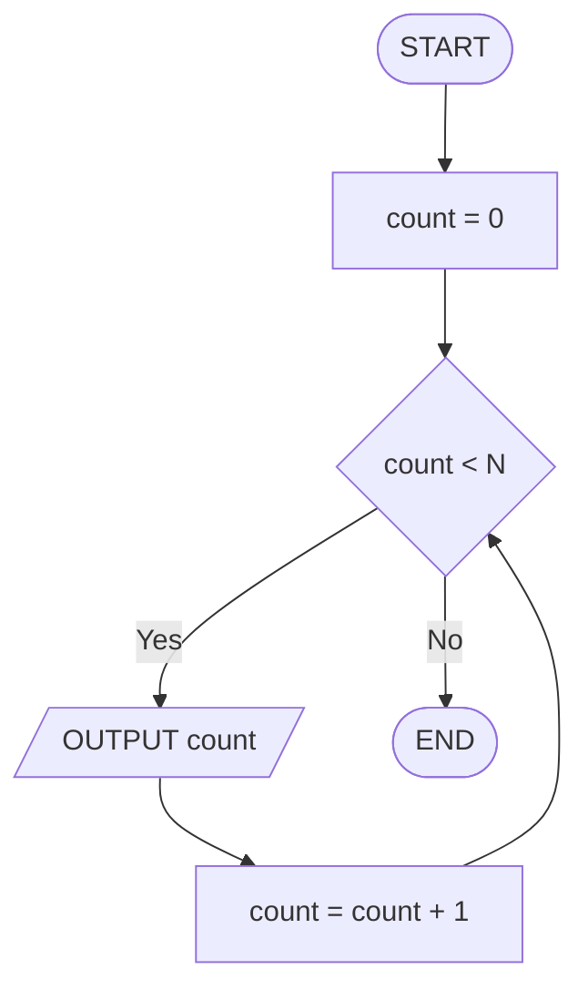
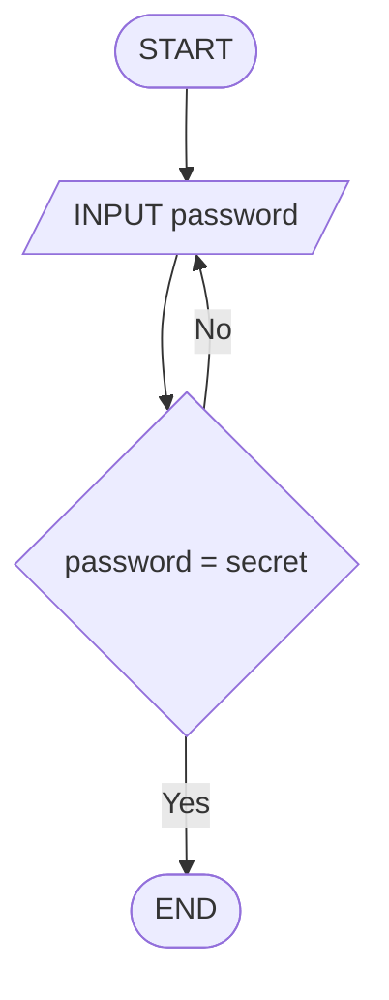
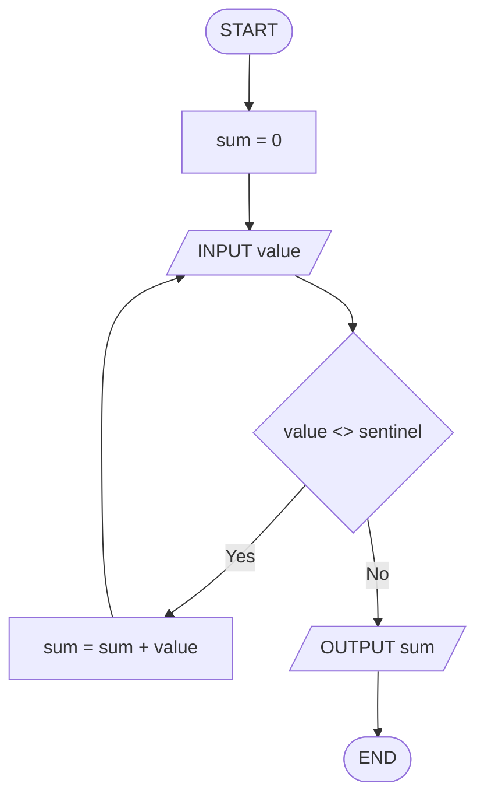

## Séance 3

Boucles (1) : WHILE / REPEAT … UNTIL

[→ Quiz](quiz_seance_03.html)
[→ Exercices](exercices_seance_03.html)

---

## Pourquoi des boucles ?

En séances 1–2 : **séquence** et **décisions** — chaque étape s'exécute **au plus une fois**.

Souvent, on doit **répéter** une action :

- compter jusqu'à N,
- additionner des nombres saisis un par un,
- redemander une saisie tant qu'elle est invalide,
- chercher le minimum / maximum parmi plusieurs valeurs.

Il faut une **boucle** (*loop*) : un bloc d'instructions répété tant qu'une **condition** le permet.

---

## Itération (*iteration*)

Une **itération** = **un tour** de boucle (une exécution du corps).

| Terme | Sens |
| --- | --- |
| Boucle (*loop*) | structure qui répète un bloc |
| Corps (*body*) | instructions à l'intérieur |
| Condition d'arrêt (*stop condition*) | quand on **quitte** la boucle |
| Itération (*iteration*) | un passage dans le corps |

Sans condition d'arrêt claire → risque de **boucle infinie** (*infinite loop*).

---

## Boucle infinie (*infinite loop*)

La condition ne devient **jamais** fausse (ou vraie, selon la forme).

Exemples de causes :

- on **oublie** de modifier la variable testée,
- la mise à jour va dans le **mauvais sens**,
- la condition est **toujours vraie** (erreur de comparaison).

En *flowchart* : une flèche qui **revient** sans chemin de sortie.  
Sur papier : on détecte souvent le bug avec une ***trace table***.

---

## `WHILE … DO … END WHILE`

On **teste avant** d'entrer dans le corps.

<div class="two-cols">

<div>

```text
count = 0
WHILE count < N DO
  OUTPUT count
  count = count + 1
END WHILE
```

</div>

<div>

| Élément | Rôle |
| --- | --- |
| `WHILE` | pose la condition |
| `DO` … `END WHILE` | corps (répété si vraie) |

Si déjà **fausse** au départ → le corps **ne s'exécute pas** (zéro itération).

</div>

</div>

---

## `WHILE` en *flowchart*

<div class="two-cols">

<div>

- Losange : **Yes** → corps, puis **retour** au test
- **No** → on sort, on continue après la boucle

Même algo que le *pseudocode* de la slide précédente.

</div>

<div class="max-mermaid-lg">



</div>

</div>

---

## `REPEAT … UNTIL`

On exécute le corps **au moins une fois**, puis on teste.

<div class="two-cols">

<div>

```text
REPEAT
  INPUT password
UNTIL password = secret
```

</div>

<div>

| Élément | Rôle |
| --- | --- |
| `REPEAT` | début du corps |
| `UNTIL` | condition d'**arrêt** (sortie quand **vraie**) |

Différence clé avec `WHILE` : le test est **après** le corps.

</div>

</div>

---

## `REPEAT … UNTIL` en *flowchart*

<div class="two-cols">

<div>

- Corps d'abord
- Losange : **No** → on recommence, **Yes** → on sort

`UNTIL` = « jusqu'à ce que … soit vrai » = sortie sur **Yes**.

</div>

<div class="max-mermaid-lg">



</div>

</div>

---

## `WHILE` vs `REPEAT … UNTIL`

| | `WHILE` | `REPEAT … UNTIL` |
| --- | --- | --- |
| Test | **avant** le corps | **après** le corps |
| Itérations mini | **0** possible | **au moins 1** |
| Condition | on reste tant que **vraie** | on sort quand **vraie** |
| Usage typique | « tant que … » | « jusqu'à ce que … » (saisie, validation) |

Même problème souvent exprimable des deux façons — on choisit selon le sens naturel.

---

## Pattern : compteur (*counter*)

Un **compteur** compte combien de fois quelque chose s'est produit.

```text
count = 0
WHILE count < N DO
  OUTPUT "tick"
  count = count + 1
END WHILE
```

Ingrédients :

1. **initialiser** (`count = 0`)
2. **tester** (`count < N`)
3. **mettre à jour** dans le corps (`count = count + 1`)

Oublier l'étape 3 → *infinite loop*.

---

## Pattern : accumulateur (*accumulator*)

Un **accumulateur** construit un résultat progressif (somme, produit…).

```text
sum = 0
count = 0
WHILE count < N DO
  INPUT value
  sum = sum + value
  count = count + 1
END WHILE
OUTPUT sum
```

- `sum` accumule
- `count` contrôle le nombre de tours
- Initialisation de `sum` **avant** la boucle

---

## Pattern : sentinelle (*sentinel*)

Une **valeur sentinelle** (*sentinel value*) signale la **fin** des données — ce n'est **pas** une donnée à traiter.

```text
sum = 0
INPUT value
WHILE value <> sentinel DO
  sum = sum + value
  INPUT value
END WHILE
OUTPUT sum
```

Exemple classique : saisir des nombres jusqu'à `-1` (la sentinelle).  
Le `-1` n'entre **pas** dans la somme.

---

## Sentinelle en *flowchart*

<div class="two-cols">

<div>

Lecture « amorcée » :

1. premier `INPUT` **avant** le test
2. `INPUT` en fin de corps
3. sentinelle → **No** → sortie (non traitée)

</div>

<div class="max-mermaid">



</div>

</div>

---

<!-- _class: compact -->

## Validation de saisie (*input validation*)

On **redemande** tant que la valeur est hors domaine.

<div class="two-cols">

<div>

```text
REPEAT
  INPUT mark
UNTIL (mark >= 0) AND (mark <= 20)
OUTPUT mark
```

</div>

<div>

```text
INPUT mark
WHILE (mark < 0) OR (mark > 20) DO
  INPUT mark
END WHILE
OUTPUT mark
```

</div>

</div>

`REPEAT … UNTIL` est souvent plus naturel : on saisit **d'abord**, on valide **ensuite**.

---

<!-- _class: compact -->

## Min / max sur saisies successives

Parmi plusieurs valeurs lues une à une : garder le plus petit / le plus grand.

```text
INPUT first
minimum = first
maximum = first
count = 1
WHILE count < N DO
  INPUT value
  IF value < minimum THEN
    minimum = value
  END IF
  IF value > maximum THEN
    maximum = value
  END IF
  count = count + 1
END WHILE
OUTPUT minimum, maximum
```

Idée : initialiser min/max avec la **première** valeur, puis comparer les suivantes.

---

<!-- _class: compact -->

## Min / max avec sentinelle

Quand le nombre de valeurs est **inconnu** :

```text
INPUT value
minimum = value
maximum = value
INPUT value
WHILE value <> sentinel DO
  IF value < minimum THEN
    minimum = value
  END IF
  IF value > maximum THEN
    maximum = value
  END IF
  INPUT value
END WHILE
OUTPUT minimum, maximum
```

Même patterns : *sentinel* + mises à jour conditionnelles.

---

## Checklist anti-boucle-infinie

Avant de valider un algorithme à boucle :

1. La condition peut-elle devenir fausse (ou vraie pour `UNTIL`) ?
2. Une variable de la condition est-elle **modifiée** dans le corps ?
3. Sens de la mise à jour correct (`+ 1` vs `- 1`) ?
4. Cas **zéro itération** prévu (`WHILE`) ?
5. Sentinelle **exclue** du traitement ?

Une ***trace table*** sur un petit jeu de données révèle vite le bug.

---

## Quiz

10 questions pour tester sa compréhension du contenu de la séance.

[→ Quiz](quiz_seance_03.html)

---

## Exercice 3.A — Compteur `WHILE`

```text
count = 0
WHILE count < N DO
  OUTPUT count
  count = count + 1
END WHILE
```

1. Compléter la *trace table* pour `N = 3`.
2. Dessiner le *flowchart*.

→ [Exercices](exercices_seance_03.html) § 3.A

---

## Exercice 3.B — Mot de passe (`REPEAT … UNTIL`)

```text
REPEAT
  INPUT password
UNTIL password = secret
OUTPUT "OK"
```

1. Compléter la *trace table* pour les saisies `wrong`, puis `secret`.
2. Dessiner le *flowchart*.

→ [Exercices](exercices_seance_03.html) § 3.B

---

## Exercice 3.C — Validation de note (*input validation*)

```text
REPEAT
  INPUT mark
UNTIL (mark >= minMark) AND (mark <= maxMark)
OUTPUT mark
```

1. Compléter la *trace table* pour les saisies `25`, puis `14` (`minMark = 0`, `maxMark = 20`).
2. Dessiner le *flowchart* (bornes nommées).

→ [Exercices](exercices_seance_03.html) § 3.C

---

## Exercice 3.D — Somme jusqu'à sentinelle

```text
sum = 0
INPUT value
WHILE value <> sentinel DO
  sum = sum + value
  INPUT value
END WHILE
OUTPUT sum
```

1. Compléter la *trace table* pour les saisies `4`, `6`, `-1` (`sentinel = -1`).
2. Dessiner le *flowchart*.

→ [Exercices](exercices_seance_03.html) § 3.D

---

## Exercice 3.E — Minimum de N saisies

```text
INPUT first
minimum = first
count = 1
WHILE count < N DO
  INPUT value
  IF value < minimum THEN
    minimum = value
  END IF
  count = count + 1
END WHILE
OUTPUT minimum
```

1. Compléter la *trace table* pour `N = 3` et les saisies `8`, `3`, `5`.
2. Dessiner le *flowchart*.

→ [Exercices](exercices_seance_03.html) § 3.E
