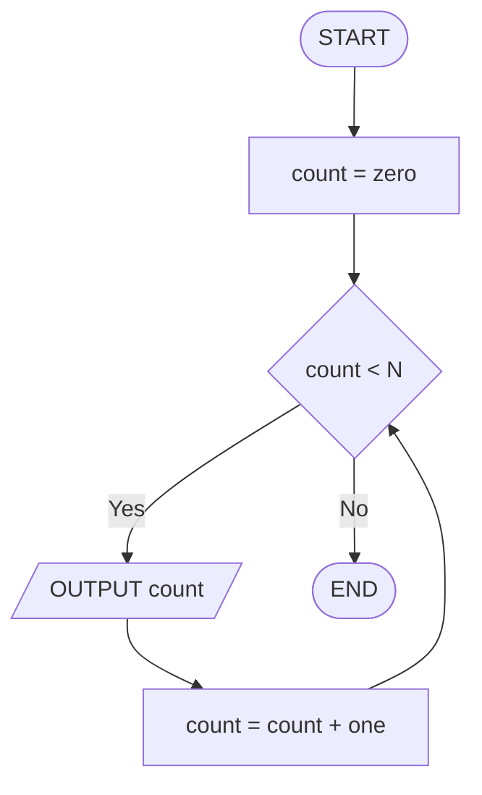
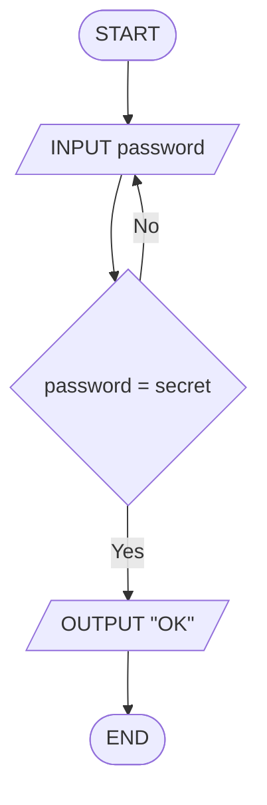
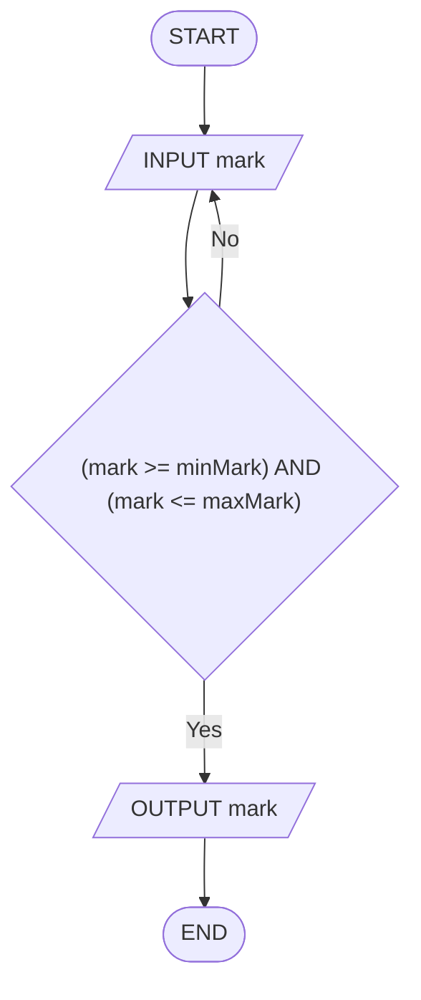
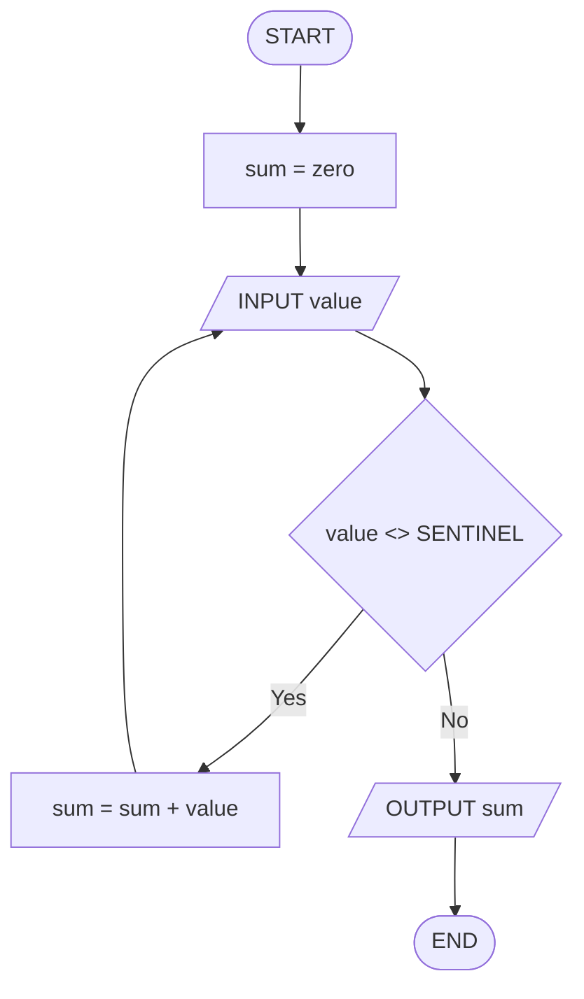
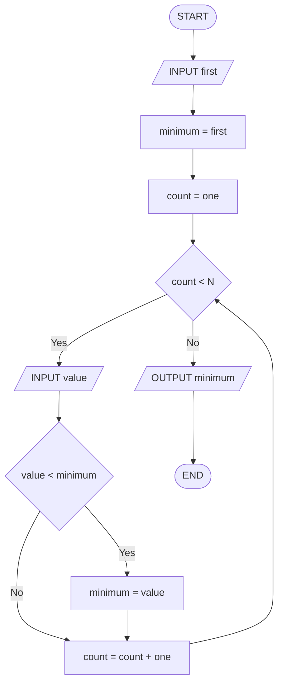

# Séance 3 — Exercices

**Thème :** Boucles (1) : WHILE / REPEAT … UNTIL  
**Support :** *flowcharts* (boucles) + *trace table* (texte FR — flowcharts + *pseudocode* EN)

Pour **chaque** exercice : produire une *trace table* **et** un *flowchart*.  
Dans les *flowcharts* : pas de littéraux numériques (les valeurs concrètes apparaissent **uniquement** dans la *trace table*).

<nav class="page-nav">
  <a href="cours_seance_03.html">← Cours</a>
  <a href="quiz_seance_03.html">Quiz →</a>
  <a href="../../index.html">Accueil</a>
</nav>

## 3.A — Compteur `WHILE`

Algorithme (`N` donné) :

```text
count = 0
WHILE count < N DO
  OUTPUT count
  count = count + 1
END WHILE
```

1. Compléter la *trace table* pour `N = 3` :

| step | count | N | condition | OUTPUT |
| --- | --- | --- | --- | --- |
| `count = 0` | | | | |
| `WHILE count < N` | | | | |
| `OUTPUT count` | | | | |
| `count = count + 1` | | | | |
| … (répéter) | | | | |

2. Dessiner le *flowchart* (sans y coller la valeur de `N`).

<details class="corrige">
<summary>Corrigé</summary>

Trois tours : sorties `0`, `1`, `2`, puis `count = 3` → condition fausse → fin.

| step | count | N | condition | OUTPUT |
| --- | --- | --- | --- | --- |
| `count = 0` | 0 | 3 | | |
| `WHILE count < N` | 0 | 3 | Yes | |
| `OUTPUT count` | 0 | 3 | | 0 |
| `count = count + 1` | 1 | 3 | | |
| `WHILE count < N` | 1 | 3 | Yes | |
| `OUTPUT count` | 1 | 3 | | 1 |
| `count = count + 1` | 2 | 3 | | |
| `WHILE count < N` | 2 | 3 | Yes | |
| `OUTPUT count` | 2 | 3 | | 2 |
| `count = count + 1` | 3 | 3 | | |
| `WHILE count < N` | 3 | 3 | No | |



(`zero` = 0, `one` = 1 — valeurs seulement dans la *trace*.)

</details>

---

## 3.B — Mot de passe (`REPEAT … UNTIL`)

Algorithme (`secret` connu) :

```text
REPEAT
  INPUT password
UNTIL password = secret
OUTPUT "OK"
```

1. Compléter la *trace table* pour les saisies successives `wrong`, puis `secret` :

| step | password | secret | UNTIL ? | OUTPUT |
| --- | --- | --- | --- | --- |
| `INPUT password` | | | | |
| `UNTIL password = secret` | | | | |
| … | | | | |

2. Dessiner le *flowchart*.

<details class="corrige">
<summary>Corrigé</summary>

Premier tour : `wrong <> secret` → No (on recommence).  
Deuxième tour : `secret = secret` → Yes → **OUTPUT OK**.

| step | password | secret | UNTIL ? | OUTPUT |
| --- | --- | --- | --- | --- |
| `INPUT password` | wrong | secret | | |
| `UNTIL password = secret` | wrong | secret | No | |
| `INPUT password` | secret | secret | | |
| `UNTIL password = secret` | secret | secret | Yes | |
| `OUTPUT "OK"` | secret | secret | | OK |



</details>

---

## 3.C — Validation de note (*input validation*)

Algorithme (note valide entre `minMark` et `maxMark`, inclus) :

```text
REPEAT
  INPUT mark
UNTIL (mark >= minMark) AND (mark <= maxMark)
OUTPUT mark
```

Données de la *trace* : `minMark = 0`, `maxMark = 20`, saisies `25`, puis `14`.

1. Compléter la *trace table*.
2. Dessiner le *flowchart* (utiliser `minMark` / `maxMark`, pas les littéraux).

<details class="corrige">
<summary>Corrigé</summary>

`25` hors intervalle → on recommence, `14` valide → **OUTPUT 14**.

| step | mark | minMark | maxMark | UNTIL ? | OUTPUT |
| --- | --- | --- | --- | --- | --- |
| `INPUT mark` | 25 | 0 | 20 | | |
| `UNTIL (mark >= minMark) AND (mark <= maxMark)` | 25 | 0 | 20 | No | |
| `INPUT mark` | 14 | 0 | 20 | | |
| `UNTIL (mark >= minMark) AND (mark <= maxMark)` | 14 | 0 | 20 | Yes | |
| `OUTPUT mark` | 14 | 0 | 20 | | 14 |



</details>

---

## 3.D — Somme jusqu'à sentinelle (*accumulator* + *sentinel*)

Algorithme (`SENTINEL` = valeur sentinelle, ici `-1`) :

```text
sum = 0
SENTINEL = -1
INPUT value
WHILE value <> SENTINEL DO
  sum = sum + value
  INPUT value
END WHILE
OUTPUT sum
```

Données de la *trace* : `SENTINEL = -1`, saisies `4`, `6`, `-1`.

1. Compléter la *trace table*.
2. Dessiner le *flowchart* (nommer `SENTINEL`, ne pas écrire `-1` dans le dessin).

<details class="corrige">
<summary>Corrigé</summary>

`4` et `6` s'accumulent. `-1` est la valeur sentinelle → **non** ajouté → **OUTPUT 10**.

| step | value | sum | SENTINEL | condition | OUTPUT |
| --- | --- | --- | --- | --- | --- |
| `sum = 0` | | 0 | -1 | | |
| `INPUT value` | 4 | 0 | -1 | | |
| `WHILE value <> SENTINEL` | 4 | 0 | -1 | Yes | |
| `sum = sum + value` | 4 | 4 | -1 | | |
| `INPUT value` | 6 | 4 | -1 | | |
| `WHILE value <> SENTINEL` | 6 | 4 | -1 | Yes | |
| `sum = sum + value` | 6 | 10 | -1 | | |
| `INPUT value` | -1 | 10 | -1 | | |
| `WHILE value <> SENTINEL` | -1 | 10 | -1 | No | |
| `OUTPUT sum` | -1 | 10 | -1 | | 10 |



</details>

---

## 3.E — Minimum de N saisies

Algorithme :

```text
INPUT first
minimum = first
count = 1
WHILE count < N DO
  INPUT value
  IF value < minimum THEN
    minimum = value
  END IF
  count = count + 1
END WHILE
OUTPUT minimum
```

Données de la *trace* : `N = 3`, saisies `8`, `3`, `5` (dans cet ordre : `first = 8`, puis `3`, puis `5`).

1. Compléter la *trace table*.
2. Dessiner le *flowchart*.

<details class="corrige">
<summary>Corrigé</summary>

Init `minimum = 8`, puis `3 < 8` → `minimum = 3`, puis `5` ne change rien → **OUTPUT 3**.

| step | first / value | minimum | count | N | OUTPUT |
| --- | --- | --- | --- | --- | --- |
| `INPUT first` | 8 | | | 3 | |
| `minimum = first` | 8 | 8 | | 3 | |
| `count = 1` | 8 | 8 | 1 | 3 | |
| `WHILE count < N` | | 8 | 1 | 3 | |
| `INPUT value` | 3 | 8 | 1 | 3 | |
| `IF value < minimum` (Yes) | 3 | 3 | 1 | 3 | |
| `count = count + 1` | 3 | 3 | 2 | 3 | |
| `WHILE count < N` | | 3 | 2 | 3 | |
| `INPUT value` | 5 | 3 | 2 | 3 | |
| `IF value < minimum` (No) | 5 | 3 | 2 | 3 | |
| `count = count + 1` | 5 | 3 | 3 | 3 | |
| `WHILE count < N` (No) | | 3 | 3 | 3 | |
| `OUTPUT minimum` | | 3 | 3 | 3 | 3 |



</details>

<footer class="site-footer"><a href="mailto:shuraux@he2b.be">Sylvain Huraux - HE2B - ISIB</a></footer>
